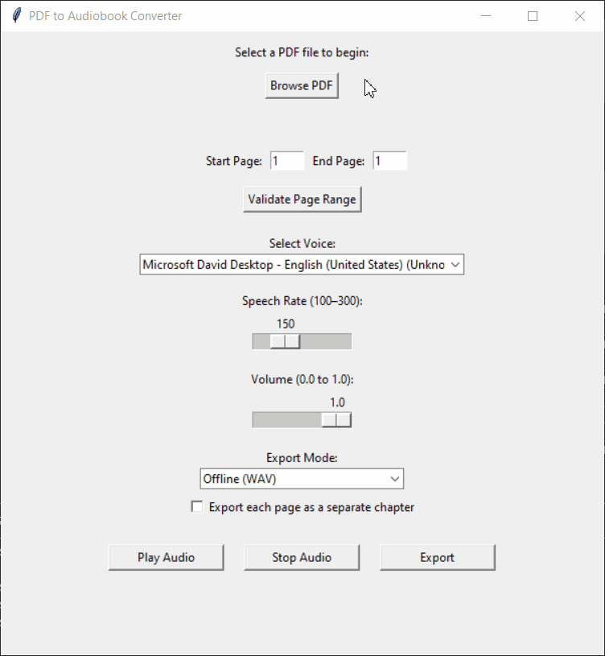
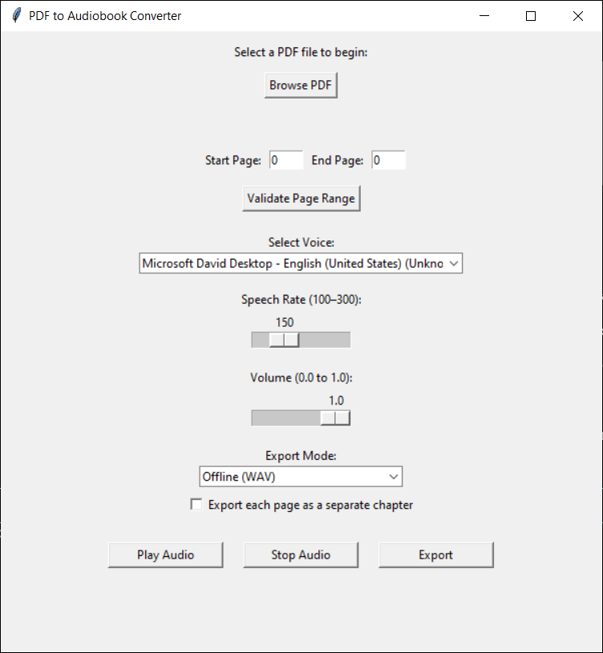
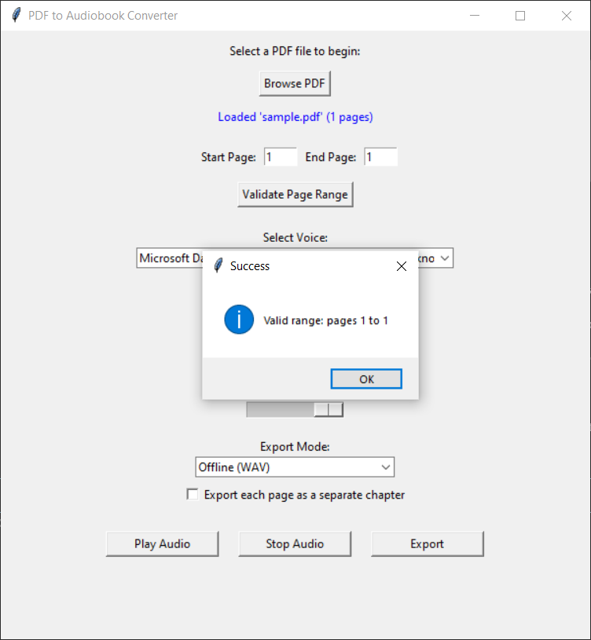

# 🎙️ PDF to Audiobook Converter

Convert any PDF into realistic, chaptered audiobooks using this polished Python GUI application.

---

## 🎧 Features

- 📄 **PDF to Speech**: Reads aloud selected page ranges.
- 💾 **Export as Audio**:
  - `.wav` via offline `pyttsx3`
  - `.mp3` via online `gTTS`
- 🗂️ **Chaptered Audio Export**:
  - Export each page as a chapter file.
  - Automatically zips all chapters into `chapters.zip`.
- 🔁 **Persistent Settings**:
  - Remembers voice, rate, volume, export mode, and last-used pages.
- 🖥️ **Simple, Modern GUI** built with `tkinter`.

---

## 🎥 Demo



---

## 🖼 Screenshots

| Home Screen                            | PDF Loaded, Ready to Play or Export           |
|----------------------------------------|----------------------------------------|
|  |  |

---

## 🧠 What This Project Demonstrates

This is more than a basic PDF reader — it shows off production-ready software engineering:

- 🧱 **Modular Architecture**: Clean separation of GUI, logic, utilities, and TTS engine.
- 🗂️ **Project Structure**: Scalable codebase following best practices.
- 🎛️ **State Persistence**: Save/load voice, volume, rate, export mode, and page range.
- 🎧 **Dual TTS Support**: Use offline `pyttsx3` or realistic online `gTTS` voices.
- 📤 **Flexible Export Options**: Export full books or ZIP chaptered audio files.
- 🧪 **Robust Error Handling**: Graceful fallbacks and detailed validation.

---

## 🧠 What I Learned

This project helped me strengthen real-world Python software engineering skills, including:

- Structuring modular, scalable code across multiple files
- Building GUIs with `tkinter` that include real-time feedback and file dialogs
- Integrating multiple TTS engines (`pyttsx3` and `gTTS`)
- Exporting audio with both `.wav` and `.mp3` formats
- Packaging chaptered content with the `zipfile` module
- Implementing persistent user preferences via `settings.json`
- Writing clean, documented, and testable code

---

## 🛠 Tech Stack

- `Python 3.8+`
- `tkinter` – GUI framework
- `pyttsx3` – Offline text-to-speech
- `gTTS` – Google Text-to-Speech (MP3 export)
- `PyPDF2` – PDF parsing
- `zipfile` / `json` – Native export + settings persistence

---

## 📁 Project Structure

```
pdf_to_audio/
├── app/
│   ├── __init__.py
│   ├── app.py              # CLI version (optional)
│   ├── gui.py              # Main GUI application
│   ├── reader.py           # PDF text extractor
│   ├── speaker.py          # TTS playback + export
│   └── utils.py            # Placeholder for future helpers
├── config/
│   └── settings.json
├── media/
│   ├── demo/
│   │   └── demo.gif
│   └── screenshots/
│       ├── home_screen.png
│       └── pdf_loaded.png
├── samples/
│   └── sample.pdf
├── .gitignore
├── README.md
└── requirements.txt
```

---

## 📂 Input/Output Formats

| Input Type | Description              |
|------------|--------------------------|
| `.pdf`     | Full PDF file with pages |

| Output Type | Description                         |
|-------------|-------------------------------------|
| `.wav`      | Offline audio (pyttsx3)             |
| `.mp3`      | Online audio (gTTS)                 |
| `.zip`      | Compressed folder of chapter files  |

---

## 💡 Future Enhancements

- 🌙 Dark Mode toggle for the GUI
- 📊 Export progress bar for long operations
- 🧾 Export transcript or full-book `.txt` files
- 📚 Kindle `.epub` and `.txt` import support
- 🔖 Smart bookmarks and chapter navigation

---

## 🧪 How to Run Locally

1. Clone the repository:
   ```bash
   git clone https://github.com/your-username/pdf-to-audio.git
   cd pdf-to-audio
   ```

2. Install the dependencies:
   ```bash
   pip install -r requirements.txt
   ```

3. Launch the GUI app:
   ```bash
   python app/gui.py
   ```